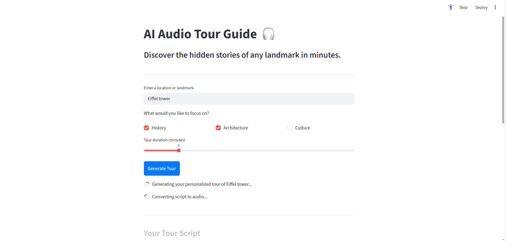
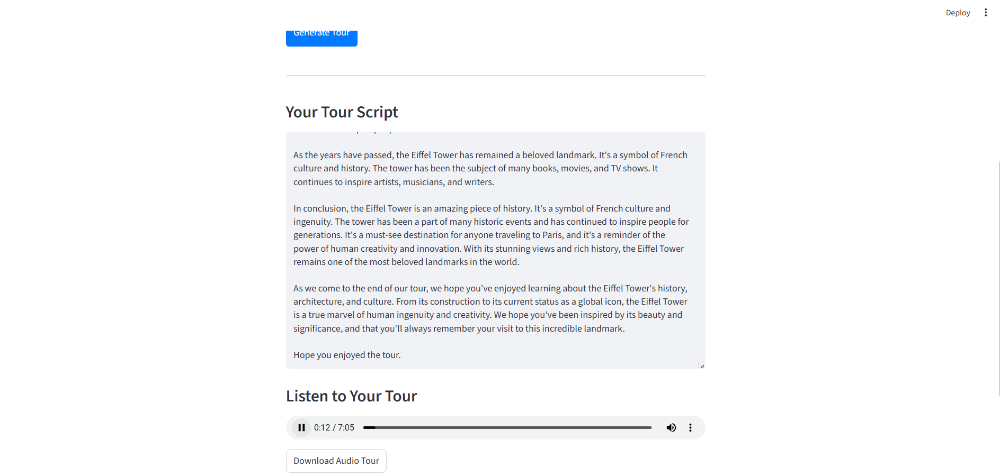

# 🎧 AI Audio Tour Guide

> A multi-agent AI app that generates a personalized, narrated audio tour of any landmark in the world — in seconds.

Built with **CrewAI**, **Groq (Llama 3.3 70B)**, **Edge-TTS**, and **Streamlit**. Total build cost: **₹0**.

---

## 🌍 Live Demo

🔗 Coming Soon

---

## 📸 Screenshots

**Home Screen**


**Filled Form**


**Generating Tour**


**Result — Script + Audio**


---

## 🎯 Problem Statement

Traditional audio guides at tourist sites are:
- **Generic** — same script for every visitor
- **Expensive** — cost money to rent or buy
- **Inflexible** — fixed duration and topics
- **Unavailable** — most landmarks have no guide at all

**AI Audio Tour Guide** solves this by generating a fully personalized, spoken tour for *any* landmark in the world — tailored to the visitor’s interests and available time — completely free.

---

## 👤 User Persona

**Rahul, 26 — Solo Traveller from Bhopal**
- Visits heritage sites on weekends
- Wants context and stories, not just facts
- Has 10–15 minutes at each spot
- Prefers simple, conversational English
- Doesn’t want to pay for a human guide

---

## 🧠 How It Works

This app uses a **5-agent CrewAI pipeline** where each agent has a specific role:

| Agent | Role | Output |
|---|---|---|
| 🗓️ Planner | Allocates word count per topic based on duration | Word plan e.g. `History: 300 words` |
| 📜 History Agent | Writes the historical narrative in simple English | History section |
| 🏛️ Architecture Agent | Describes design and structure in plain language | Architecture section |
| 🎭 Culture Agent | Covers local traditions and heritage simply | Culture section |
| 🎙️ Orchestrator | Joins all sections smoothly and converts to audio | Final MP3 tour |

### Agent Flow
```
User Input
    ↓
Planner Agent → Word allocation plan
    ↓
History + Architecture + Culture Agents (parallel writing)
    ↓
Orchestrator Agent → Final unified script
    ↓
Edge-TTS → MP3 audio file
    ↓
Streamlit UI → Audio player + Download button
```

---

## 💬 Agent Prompts

These are the actual prompts used to build each agent:

### 🗓️ Planner Agent
```
Based on a {duration} minute duration (approx 130 words per min),
allocate word counts for: {topics}. Location: {location}.
Output format: 'Topic: X words'.
```

### 📜 History Agent
```
Write the history of {location}.
Use simple English and short sentences.
Follow the word count from the plan.
```

### 🏛️ Architecture Agent
```
Write about the architecture and design of {location}.
Use simple English and short sentences.
Explain how it looks, what makes it unique, and what materials were used.
Follow the word count from the plan.
```

### 🎭 Culture Agent
```
Write about the local culture and traditions around {location}.
Use simple English and short sentences.
Cover festivals, customs, and artistic heritage.
Follow the word count from the plan.
```

### 🎙️ Orchestrator Agent
```
Join all the written sections into one smooth tour script.
Add a warm 'Welcome to this audio tour' line at the start
and a 'Hope you enjoyed the tour' sign-off.
Ensure transitions between sections are natural.
Keep the same simple language throughout.
```

---

## 🔧 Key Design Decisions

| Decision | Reasoning |
|---|---|
| Simple English enforced in all prompts | Tours are consumed while walking — complex words break the listening experience |
| Duration slider 5–30 mins | Covers quick stops to deep dives without overwhelming the LLM |
| Groq instead of OpenAI | Free, fast inference — Llama 3.3 70B handles narrative writing well |
| Edge-TTS over paid TTS APIs | en-US-JennyNeural produces natural speech, zero cost, no API key needed |
| Streamlit Cloud for hosting | Free public URL, GitHub-connected, perfect for portfolio demos |
| Sequential agent pipeline | Ensures Orchestrator always gets complete sections before joining |

---

## 📊 Success Metrics (PM View)

| Metric | Target |
|---|---|
| Time to generate a 10-min tour | < 60 seconds |
| Audio naturalness (Jenny voice) | Conversational, no robotic tone |
| Script readability | Grade 6 reading level or below |
| Zero-cost operation | No paid APIs used |
| Deployable without local setup | One-click Streamlit Cloud deploy |

---

## ⚠️ Known Limitations

- **Groq free tier**: 200 actions/month — suitable for demos, not production scale
- **No real-time data**: Agents use LLM knowledge, not live web scraping
- **Audio saved locally**: MP3 files are generated server-side; large concurrent usage would need cloud storage
- **English only**: Edge-TTS supports multi-language but current prompts are English-only

---

## ⚙️ Tech Stack

| Layer | Tool | Cost |
|---|---|---|
| Multi-Agent Framework | CrewAI | Free |
| LLM | Groq — Llama 3.3 70B | Free |
| Text to Speech | Edge-TTS (en-US-JennyNeural) | Free |
| UI | Streamlit | Free |
| Hosting | Streamlit Community Cloud | Free |

**Total cost: ₹0**

---

## 🚀 Run Locally

### 1. Clone the repo
```bash
git clone https://github.com/jainsiddhant26/ai-audio-tour.git
cd ai-audio-tour
```

### 2. Create virtual environment
```bash
python -m venv venv
venv\Scripts\activate  # Windows
source venv/bin/activate  # Mac/Linux
```

### 3. Install dependencies
```bash
pip install -r requirements.txt
pip install litellm
```

### 4. Add API keys
Create a `.env` file in the root:
```
GROQ_API_KEY=your_groq_key_here
TAVILY_API_KEY=your_tavily_key_here
```
- Get Groq API key free at → [console.groq.com](https://console.groq.com)
- Get Tavily API key free at → [app.tavily.com](https://app.tavily.com)

### 5. Run the app
```bash
streamlit run app.py
```

---

## 📁 Project Structure

```
ai-audio-tour/
├── app.py                  # Streamlit UI
├── tts.py                  # Edge-TTS audio generation
├── agents/
│   ├── __init__.py
│   └── tour_agents.py      # CrewAI 5-agent pipeline
├── outputs/                # Generated audio files
├── assets/                 # Screenshots
├── requirements.txt
└── .env                    # API keys (not committed)
```

---

## 👤 Author

Built by [Siddhant Jain](https://github.com/jainsiddhant26) as part of an AI PM Portfolio.

> *This project demonstrates multi-agent AI system design, prompt engineering, zero-cost architecture decisions, and end-to-end product thinking — from problem statement to live deployment.*
